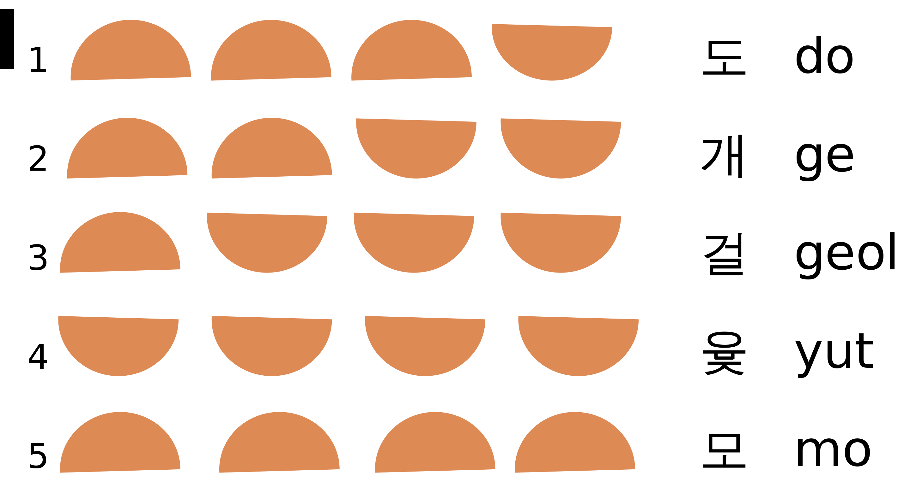

# Yut Game (Four Sticks Game) Kata

Further Information about Yutnori(Yut Game):
- https://en.wikipedia.org/wiki/Yut
- https://static1.squarespace.com/static/5cf021045a1cc30001b48fe1/t/6011a8b4fe225e098825d451/1611770037328/yut+nori+inst.pdf

Yutnori is a traditional Korean game that is played with four sticks called Yut (acting as dice), a game board, and tokens. The players take turns throwing the Yut sticks and moving their tokens along the game board based on the outcome of the throw. The game is won when a player has taken all their tokens from the start to the end of the board.

This kata is an adaptation of the game designed to practice TDD.

## Your task

Your task is to develop a program that simulates a game of Yutnori. The program should enable two players to take turns throwing sticks and moving their tokens along a simplified game board, with the objective of moving all their tokens across the board before their opponent does.

## Requirements

# Game Board and Game Tokens:

For the purposes of this kata, the original game board has been simplified to a one-dimensional array. You should use a string
array of length 15 to represent 15 spaces on the game board.

The game board should have a method to output a visual representation of the board state.
For Example:

```
board = GameBoard()
board.displayBoard()
>[[A1],[],[],[],[],[],[B1,B2],[],[],[],[],[A2],[],[],[]]
```

For the purposes of this kata, we will use two tokens per player. 
The playing tokens can be represented as follows:

```
PlayerATokens = [A1,A2]
PlayerBTokens = [B1,B2]
```

# Game Play:
- Each player has the following commands available each turn:

```
Player.Throw()
Player.Move(playerToken)
```
- Players take turns throwing four sticks, which can land with either the flat side up (x) or the rounded side up (o).
- Each possible combination of stick throws is associated with a different move on the game board as follows:

```
DO = "ooox" Move 1 space
GE = "ooxx" Move 2 spaces
GEOL = "oxxx" Move 3 spaces
Yut = "xxxx" Move 4 spaces (get another throw)
MO = "oooo" Move 5 spaces (get another throw)
```

The order or exact match of the sticks does not matter. For example, oxoo counts as DO, xoxo counts as GE, and xxox counts as GEOL.



Image source: https://en.wikipedia.org/wiki/Yut

## Rules

- All tokens start off the board.
- The player moves a token of choice (e.g. A1 or A2) on the game board based on the outcome of a throw.
- A player can have multiple tokens on the board at the same time.
- A players tokens can both be stacked on the same space. This could be represented as "[A1,A2]".
- If a player's token lands on a space already occupied by another player's token, the other player's token is sent off the board and must start again.
- The player must throw the exact combination of sticks to move their token to the last space. For example, if a player has one space left they must throw a `DO` to win the game.
- Once a player's token reaches the last space, the token is removed from the board.
- The winner is the first player to move all their tokens to the last space of the game board.

## Example Game

You may use this example as a basis for your acceptance test

```
$[[][][][][][][][][][][][][][][]]
$PlayerA's turn
>PlayerA.Throw()
$The throw is GEOL xxxo
>PlayerA.Move(A1)
$[[][][A1][][][][][][][][][][][][]]
$PlayerB's turn
>PlayerB.Throw()
$The throw is GEOL xxxo
>PlayerB.Move(B1)
$[[][][B1][][][][][][][][][][][][]]  *Note A1 is sent off the board and must start over, as PlayerB moved their token on the same space.

......... game continuing

$[[][][][A1,A2][][][][][][][B1][][B2][][]]
$PlayerB's turn
>PlayerB.Throw()
$The throw is YUT xxxx
>PlayerB.Move(B1)
$[[][][][A1,A2][][][][][][][][][B2][][]]  *Note B1 is taken off the board, as YUT was the correct throw to move to the last space
$PlayerB's turn                           *Note PlayerB gets another throw as they threw a YUT
>PlayerB.Throw()
$The throw is GEOL xxxo
>PlayerB.Move(B2)
$[[][][][A1,A2][][][][][][][][][B2][][]]  *Note B2 stays in the same place, as GEOL is not the correct throw to move to the last space

......... game continuing

$[[][][][][][][][A2][][][A1][][B2][][]]
$PlayerB's turn
>PlayerB.Throw()
$The throw is GE xoxo
>PlayerB.Move(B2)
$The winner is PlayerB
```

## Bonus features and refactoring

- Allow the game board to be customized to any size.
- Allow the number of player tokens to be adjusted.
- Allow for more than two players.
- If a player throws a score greater than the number of remaining spaces to the last space on the board, the token should wrap around the board and continue moving from the start.
- Introduce obstacles on the game board such that when a player lands on them, they either miss a turn or move their token back a few spaces.
